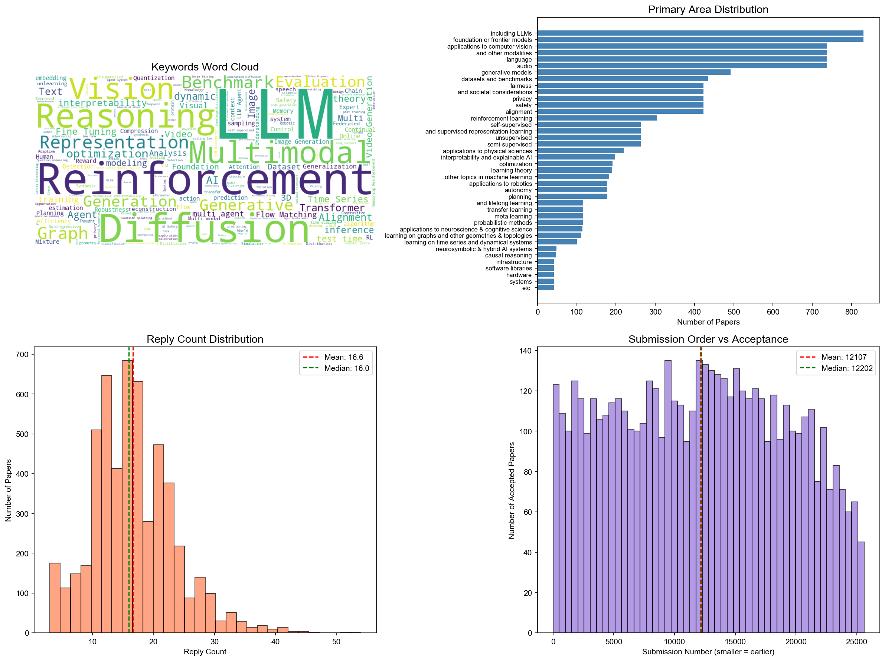
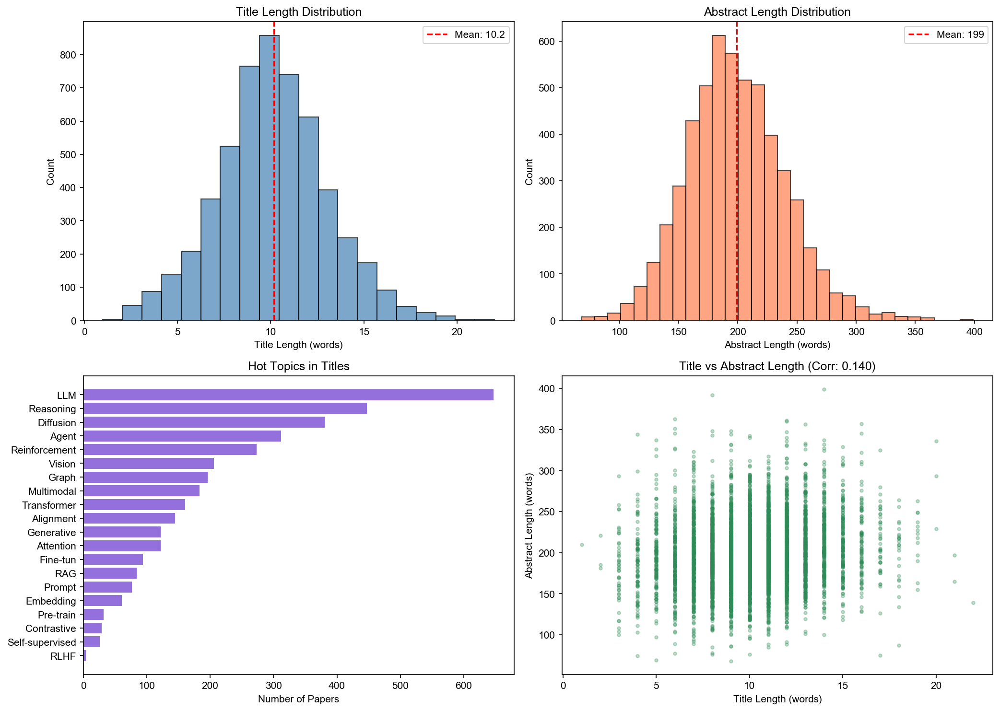
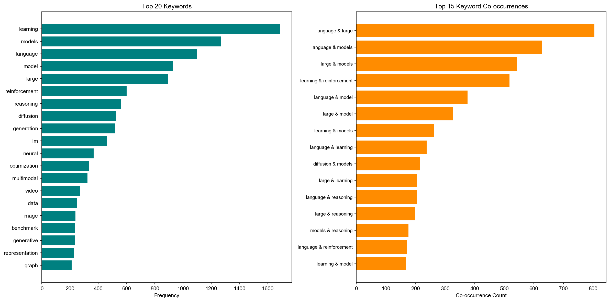
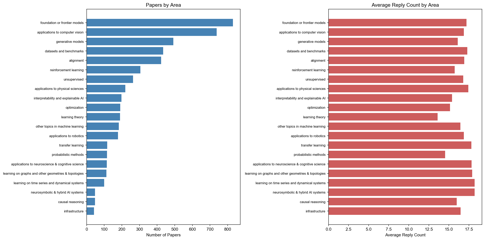
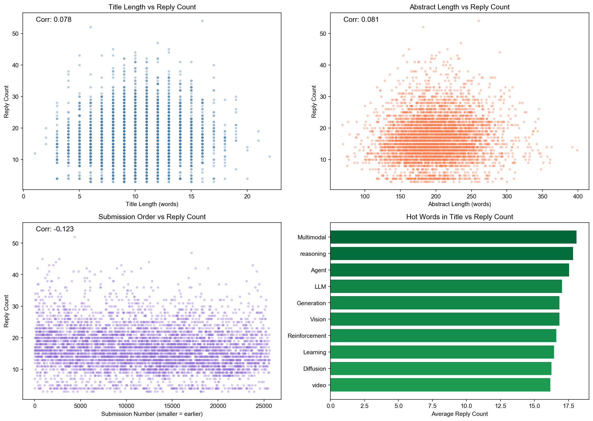

# ICLR 2026 录用论文合集

[English](README.md) | 中文版

本仓库包含 ICLR 2026 所有录用论文的数据，以及分析脚本和可视化结果。



---

## 快速开始

### 1. 获取所有论文

运行以下命令从 OpenReview 获取所有录用论文：

```bash
pip install requests tqdm
python request_ilcr26.py
```

这将生成：
- `iclr26_all_papers.json` - JSON 格式的论文数据
- `iclr26_all_papers.csv` - CSV 格式的论文数据

### 2. 运行分析

```bash
pip install pandas matplotlib wordcloud
python analysis.py
python deep_analysis.py
```

---

## 分析结果

### 深度分析

#### 1. 文本分析



- 标题长度分布（单词数）
- 摘要长度分布（单词数）
- 标题中热门话题词频（LLM、Diffusion、Reinforcement 等）
- 标题长度 vs 摘要长度相关性

#### 2. 关键词分析



- Top 20 高频关键词
- Top 15 关键词共现对

#### 3. 领域分析



- 各研究领域论文数量
- 各研究领域平均回复数

#### 4. 相关性分析



- 标题长度 vs 回复数
- 摘要长度 vs 回复数
- 投稿顺序 vs 回复数
- 标题热门词 vs 回复数

---

## 反馈

如果你觉得这个分析对你有帮助，欢迎在 [Issues](../../issues) 中留言夸夸我或者感谢我！你的支持是我最大的动力。

---

## 引用

如果你在研究中使用了本仓库，请按以下格式引用：

```bibtex
@misc{iclr2026analysis,
  author       = {kmno4-zx},
  title        = {ICLR 2026 Papers Simple Analysis},
  year         = {2026},
  publisher    = {GitHub},
  howpublished = {\url{https://github.com/kmno4-zx/iclr26-all-papers}}
}
```

---

## 许可证

Apache License 2.0
